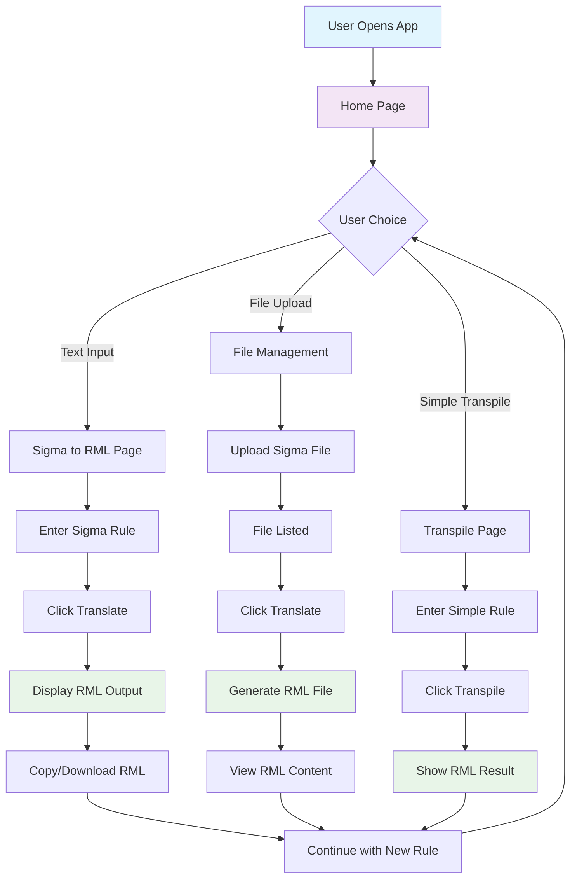
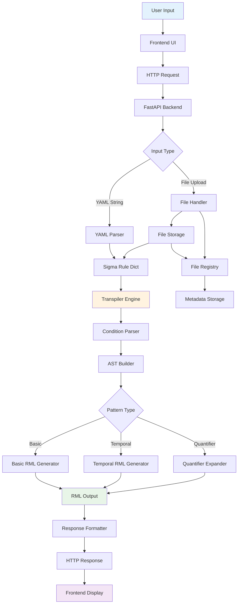
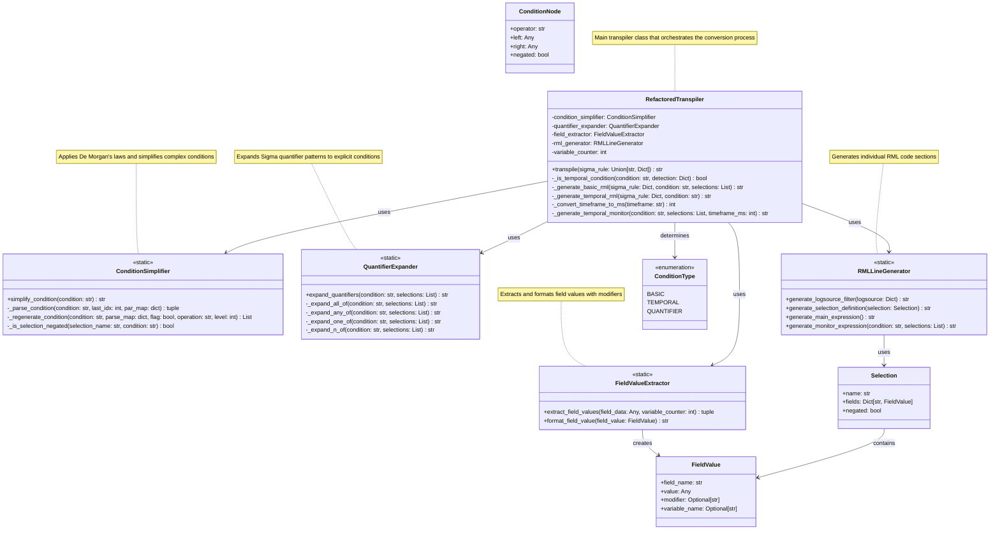
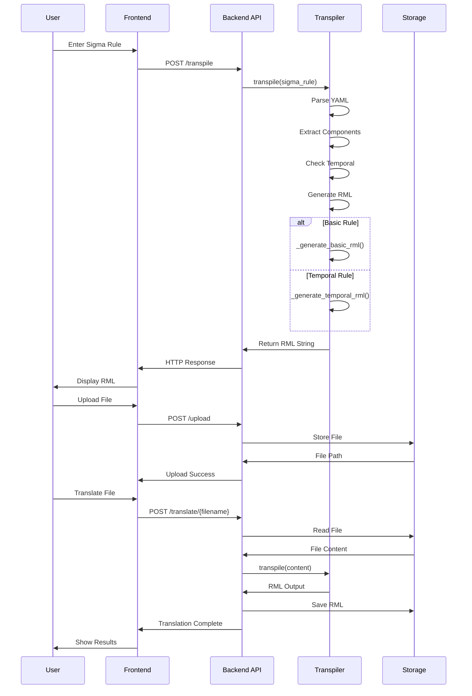
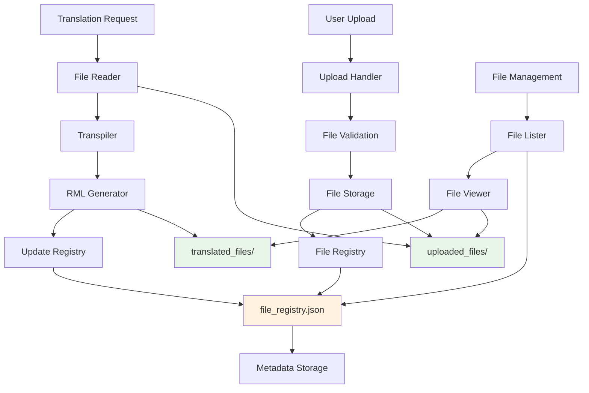
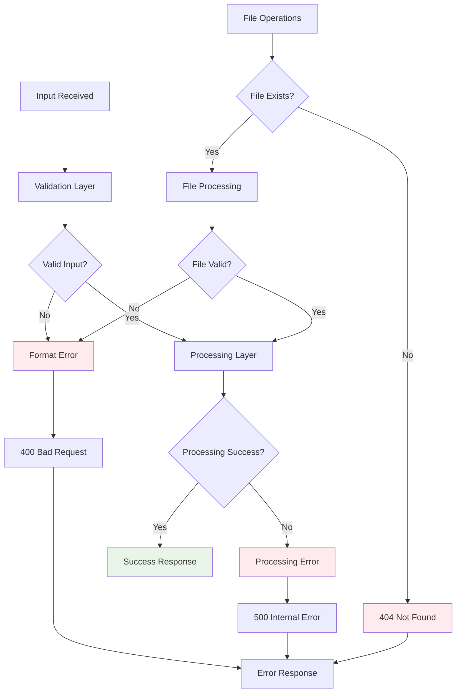
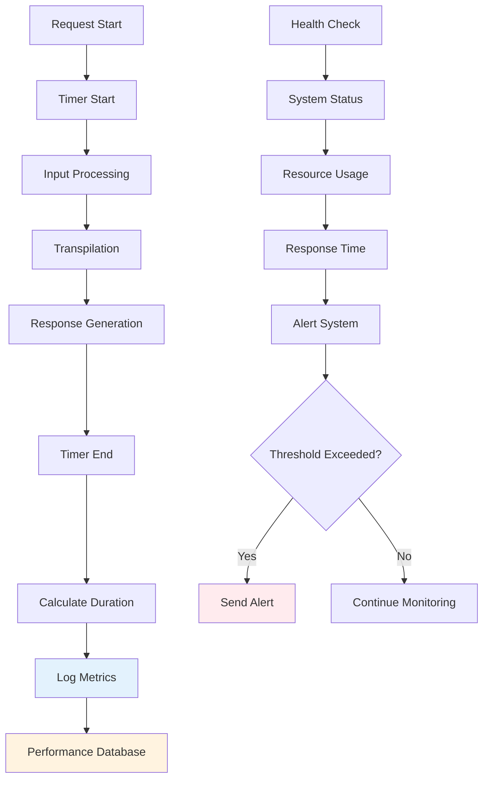

# System Diagrams

This document contains all system diagrams for the Sigma to RML Transpiler project, created using Mermaid.js syntax.

## UI Flow Diagram

The UI flow diagram shows the user interaction flow through the application interface.

## Data Flow Diagram (DFD)

The data flow diagram illustrates how data moves through the system components.

## UML Class Diagram - Core Transpiler Engine

The UML class diagram shows the structure and relationships of the core transpiler classes.

## Component Interaction Diagram

This diagram shows how the different components interact during the transpilation process.

## File Storage Architecture

This diagram illustrates the file storage and management system.

## Error Handling Flow

This diagram shows how errors are handled throughout the system.

## Performance Monitoring Flow

This diagram shows how the system monitors and reports performance metrics.

These diagrams provide a comprehensive view of the system architecture, data flow, and component interactions. They can be rendered using any Mermaid.js compatible viewer or documentation system.
